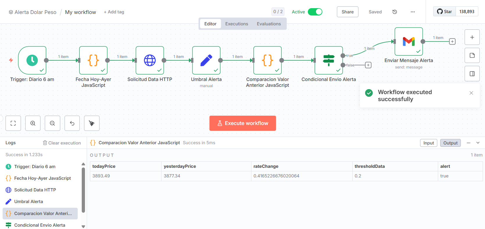
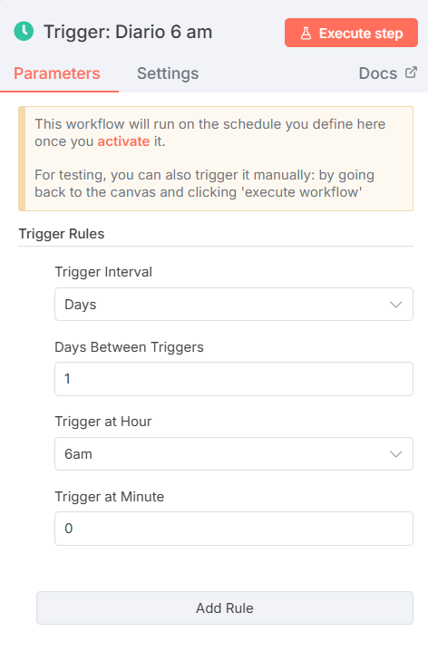
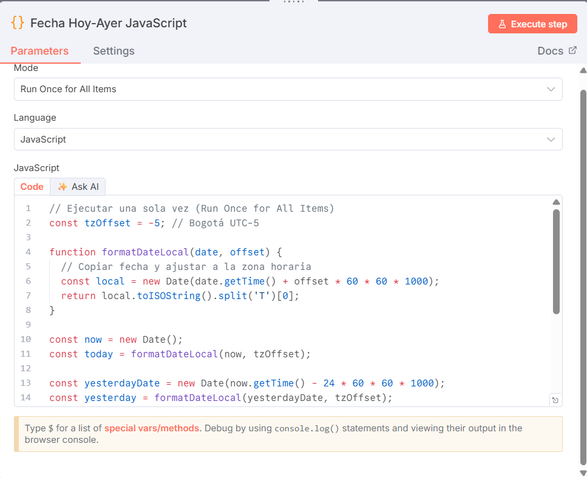
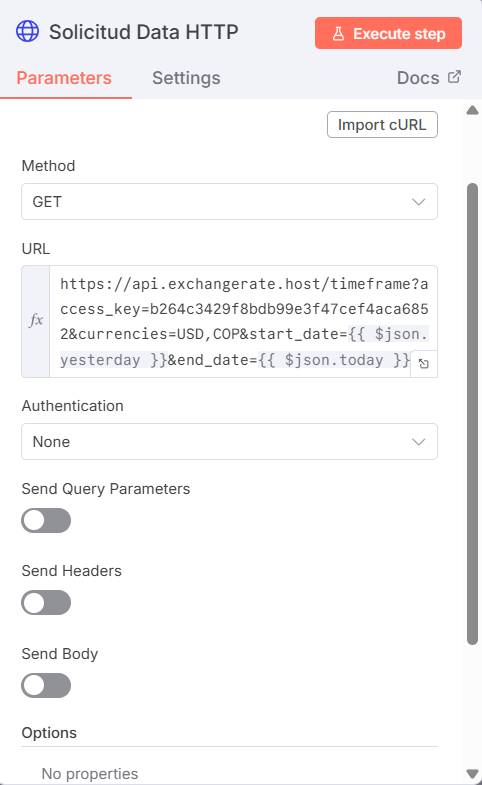
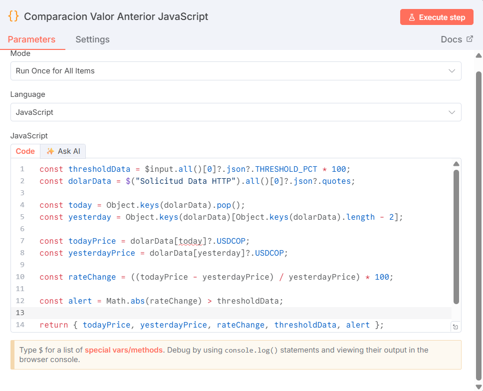
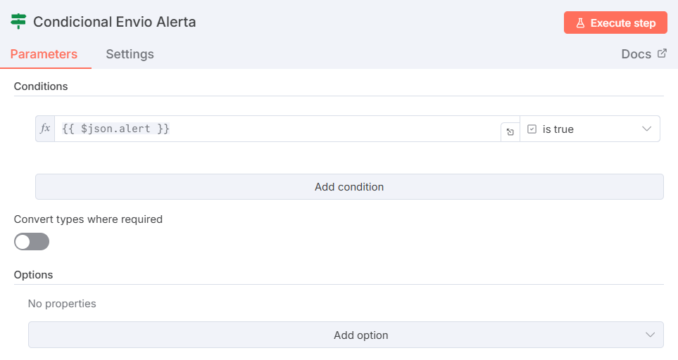
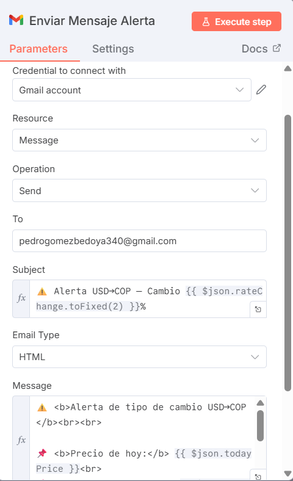
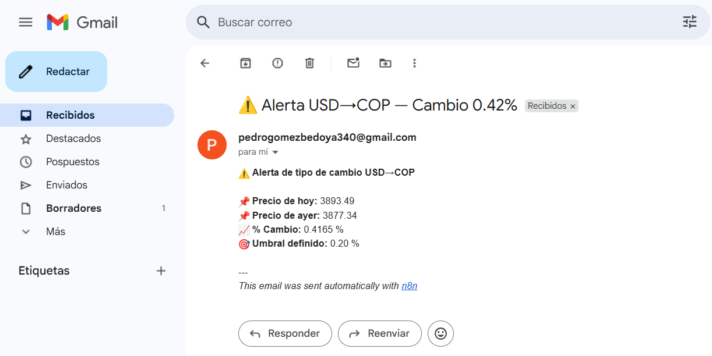

# 📌 Proyecto: Automatización de Alertas de Tipo de Cambio USD→COP con N8N

Este repositorio corresponde a la **Evaluación 03 - Diseño y Solución de Problemas con Agentes de IA** de la asignatura **Introducción a la Inteligencia Artificial**, dentro de la **Maestría en Ciencia de Datos y Analítica (Universidad EAFIT)**.

La solución presentada se construyó utilizando **N8N** para la orquestación de flujos de trabajo y automatización de procesos.

---

## 👨‍🎓 Autores

- Santiago Carvajal Torres — scarvajat1@eafit.edu.co  
- Pedro Gómez Bedoya — pgomezb@eafit.edu.co

---

## 📖 Planteamiento del Problema

En entornos financieros y de negocio es fundamental detectar de manera temprana variaciones significativas en el **tipo de cambio USD→COP**.  
Una alerta automática permite a las empresas anticiparse a riesgos cambiarios y tomar decisiones oportunas (por ejemplo, cubrirse ante una devaluación o aprovechar un fortalecimiento).

**Problema identificado:**
- La revisión de tasas de cambio se realiza de forma manual.  
- No existe un mecanismo de notificación automática que alerte sobre cambios relevantes.  
- Esto implica riesgo operativo y pérdida de oportunidades en la gestión cambiaria.

---

## ⚙️ Justificación de la Tecnología

Se evaluaron dos tecnologías propuestas en el taller: **N8N** y **Streamlit**.

- **Streamlit** es ideal para aplicaciones interactivas y análisis exploratorio, pero requiere mayor desarrollo en Python y un mecanismo adicional para notificaciones.  
- **N8N** ofrece integración nativa con múltiples APIs, lógica condicional, programadores (triggers) y conectores de correo, lo que permite:  
  - Automatizar la consulta diaria de tasas de cambio.  
  - Aplicar reglas de comparación contra un umbral configurable.  
  - Enviar alertas por correo cuando se supere dicho umbral.

👉 Por lo tanto, **N8N es la herramienta más adecuada** para este caso: rapidez de implementación, escalabilidad y mantenimiento sencillo.

---

## 🛠️ Descripción del Workflow y Guía de Uso

El flujo completo se encuentra exportado en [`Workflow.json`](./Workflow.json).  
A continuación se presenta su estructura, primero la vista general y luego el detalle **nodo a nodo**, explicando su función y configuración.

### 📸 Vista General del Flujo


---

### 1️⃣ Trigger (Diario 6:00 a. m.)
- **Función:** Dispara la ejecución automática del flujo todos los días a las 6:00 a. m.  
- **Configuración:**  
  - Nodo: **Cron**.  
  - Hora: `06:00`.  
  - Frecuencia: diaria.  
- **Importancia:** Permite que la consulta y el análisis de la tasa de cambio sean **totalmente autónomos**.  


---

### 2️⃣ Fecha Hoy–Ayer (JavaScript)
- **Función:** Calcula dinámicamente las fechas de **hoy** y **ayer** en formato `YYYY-MM-DD`.  
- **Configuración:**  
  - Nodo: **Function**.  
  - Código: Actualiza dinamicamente fecha de hoy y ayer, NO modificar.
- **Importancia:** Garantiza comparar siempre el valor actual con el del día anterior sin intervención manual.  


---

### 3️⃣ Solicitud Data HTTP
- **Función:** Consulta la API pública [`exchangerate.host`](https://exchangerate.host/) para obtener el valor de USD→COP en las fechas definidas.  
- **Configuración:**  
  - Nodo: **HTTP Request**.  
  - Método: `GET`.  
  - URL:
    ```
    https://api.exchangerate.host/timeframe?access_key=b264c3429f8bdb99e3f47cef4aca6852&currencies=USD,COP&start_date={{ $json.yesterday }}&end_date={{ $json.today }}
    ```  
- **Importancia:** Provee los datos crudos sobre los cuales se calcula la variación.  


---

### 4️⃣ Umbral Alerta (Set Node)
- **Función:** Define el valor de `THRESHOLD_PCT`, que representa el % de variación que dispara la alerta.  
- **Configuración:**  
  - Nodo: **Set**.  
  - Campo: `THRESHOLD_PCT`.  
  - Valor: por ejemplo `0.002` representara el 0.2% (especificarlo en decimas).
- **Importancia:** Permite **personalizar la sensibilidad** del sistema según la necesidad.  


---

### 5️⃣ Comparación Valor Anterior (JavaScript)
- **Función:** Calcula el **% de variación** entre el valor actual y el del día anterior; también prepara los campos listos para el correo.  
- **Configuración:**  
  - Nodo: **Function**.  
  - Código: Calcula la variacion de precios, NO modificar.
- **Importancia:** Es el **núcleo lógico** del flujo; genera los datos para una posterior validacion de si corresponde enviar la alerta o no.


---

### 6️⃣ Condicional Envío Alerta (IF Node)
- **Función:** Evalúa si la variación calculada **supera el umbral** definido y si lo supera envia el correo.  
- **Configuración:**  
  - Nodo: **IF**.  
  - Condición:  
    ```
    {{$json.changePct}} > {{$json.thresholdPct}}
    ```
- **Importancia:** Controla la **decisión** del flujo, evitando correos innecesarios.  


---

### 7️⃣ Enviar Mensaje Alerta (Gmail)
- **Función:** Envía un correo con los resultados: precio de hoy, precio de ayer, % de variación y umbral configurado.  
- **Configuración:**  
  - Nodo: **Gmail** (Email Send).  
  - Subject:
    ```
    ⚠️ Alerta USD→COP — Cambio {{$json.changePct}}%
    ```
  - Message (HTML):
    ```html
    ⚠️ <b>Alerta USD→COP</b><br><br>
    📌 <b>Precio de hoy:</b> {{$json.todayPrice}}<br>
    📌 <b>Precio de ayer:</b> {{$json.yesterdayPrice}}<br>
    📈 <b>% Cambio:</b> {{$json.changePct}} %<br>
    🎯 <b>Umbral definido:</b> {{$json.thresholdPct}} %
    ```
- **Importancia:** Es la **salida final** del flujo, entregando la notificación de forma clara y oportuna.

📸 **Configuración del nodo en N8N**  


📨 **Ejemplo de correo recibido**  


