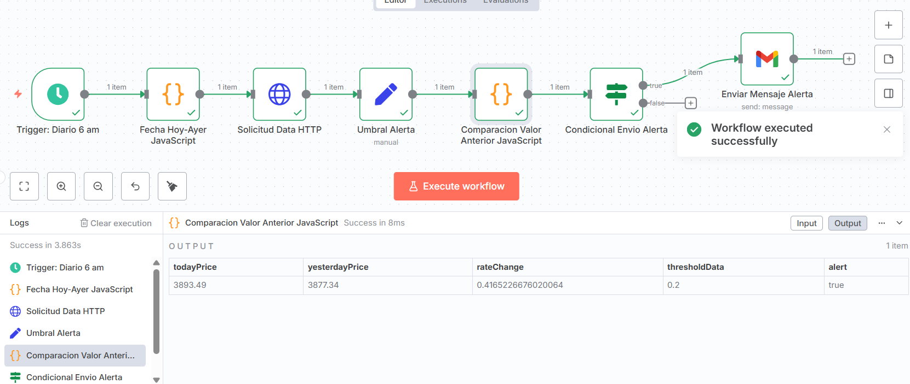

# 📌 Proyecto: Automatización de Alertas de Tipo de Cambio USD→COP con N8N

Este repositorio corresponde a la **Evaluación 03 - Diseño y Solución de Problemas con Agentes de IA** de la asignatura **Introducción a la Inteligencia Artificial**, dentro de la **Maestría en Ciencia de Datos y Analítica (Universidad EAFIT)**.

La solución presentada se construyó utilizando **N8N** para la orquestación de flujos de trabajo y automatización de procesos.

---

## 👨‍🎓 Autores

- Santiago Carvajal Torres - scarvajat1@eafit.edu.co
- Pedro Gómez Bedoya - pgomezb@eafit.edu.co

---

## 📖 Planteamiento del Problema

En entornos financieros y de negocio es fundamental detectar de manera temprana variaciones significativas en el **tipo de cambio USD→COP**.  
Una alerta automática permite a las empresas anticiparse a riesgos cambiarios y tomar decisiones oportunas (por ejemplo, cubrirse ante una devaluación o aprovechar un fortalecimiento).

El problema identificado es:
- Actualmente la revisión de tasas de cambio se realiza de forma manual.  
- No existe un mecanismo de notificación automática que alerte sobre cambios relevantes en la tasa.  
- Esto implica riesgo operativo y pérdida de oportunidades en la gestión cambiaria.

---

## ⚙️ Justificación de la Tecnología

Para resolver este problema se evaluaron dos tecnologías propuestas en el taller: **N8N** y **Streamlit**.

- **Streamlit** es ideal para aplicaciones interactivas y análisis exploratorio, pero requiere mayor desarrollo en Python y despliegue de servicios adicionales para notificaciones.  
- **N8N** ofrece integración nativa con múltiples APIs, lógica condicional y conectores de correo electrónico, lo cual lo hace perfecto para:  
  - Automatizar la consulta diaria de tasas de cambio.  
  - Aplicar reglas de comparación contra un umbral configurable.  
  - Enviar alertas automáticas por correo cuando se supere dicho umbral.  

👉 Por lo tanto, **N8N es la herramienta más adecuada** para este caso: garantiza rapidez de implementación, escalabilidad y mantenimiento sencillo.

---

## 🛠️ Descripción del Workflow

El flujo completo se encuentra exportado en el archivo [`Workflow.json`](./Workflow.json).  

El flujo está compuesto por los siguientes nodos:

1. **Trigger (Diario 6 am)** → Ejecuta el flujo automáticamente cada mañana.  
2. **Fecha Hoy–Ayer (JavaScript)** → Genera dinámicamente las fechas de hoy y ayer en formato `YYYY-MM-DD`.  
3. **Solicitud Data HTTP** → Consulta la API pública [`exchangerate.host`](https://exchangerate.host/) para obtener el valor de USD→COP.  
4. **Umbral Alerta (Set Node)** → Nodo manual donde se define el % de cambio que dispara la alerta.  
5. **Comparación Valor Anterior (JavaScript)** → Calcula el cambio porcentual y lo compara con el umbral.  
6. **Condicional Envío Alerta** → Si el cambio supera el umbral, continúa. Si no, termina.  
7. **Enviar Mensaje Alerta (Gmail)** → Envía un correo electrónico con los detalles: precio actual, precio anterior, % cambio y umbral definido.

---

## 📸 Imágenes del Flujo

Las siguientes imágenes ilustran la estructura del flujo y sus nodos (ubicadas en la carpeta [`fotos`](./fotos)):

-   
- 
